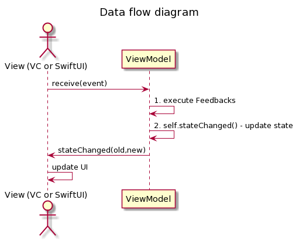

# Reducer View Model

Concept of truly unidirectional iOS (and Mac?) MVVM architecture inspired by Redux (using States, Events and Reducer).

**The same View Model code, with no modifications, works well with both UIKit View Controllers and SwiftUI Views**.

This is heavily inspired by [Vadim Bulavin's article "Modern MVVM iOS App Architecture with Combine and SwiftUI"](https://www.vadimbulavin.com/modern-mvvm-ios-app-architecture-with-combine-and-swiftui/). Highly recommended to check out the article and whole blog, great stuff!

The main difference from solution in Vadim's article is the goal to be usable for SwiftUI while having backwards compatibility for UKIt and pre-iOS 13, allowing easier migration from UIKit to SwiftUI in the future. That of course requires some compromises, mostly because Combine cannot be used in the core concept. It is used only in SwiftUI support layer.

Since this is more of a _concept showcase_ then full-blown solution framework, all 3rd party solutions are ignored to keep simplicity.

## Core advantages

- 🤝 Works great with both **SwiftUI** and **UIKit** without any changes needed in View Model code.
- ♻️ Truly **unidirectional flow of events and data** in the MVVM architecture.
    - Many MVVM implementations allow to bypass / break uni-directional flow of data (be it by direct access to state properties or other ways).
- ⚓️ Enforcing **one state at a time** avoids complexity explosion.
    - Avoid growing complexity caused by adding more and more View Model properties impacting its "one global state".
- 💪 Effort to treat `UIViewController` as much similar to SwiftUI Views as possible.
    - It is not always perfect, but have a look at [ExampleUIViewControllerFromStoryboard.swift](Example/ReducerViewModel/UI/ExampleUIViewControllerFromStoryboard.swift).

## Show me!

Have a look at the [Example project showcasing using the same View Model with both UIViewController and SwiftUI](Example) or have a look at the [ReducerViewModel.swift](ReducerViewModel.swift).

## Start preparing now to have smooth SwiftUI migration in the future

If you cannot use SwiftUI in your codebase yet (because SwiftUI has Deployment Target iOS 13 and you cannot drop older iOS versions support), this concept can make your future transition to SwiftUI based MVVM a breeze.

1. Implement View Model (`ViewModel` protocol)
2. Implement MVVM using `UIViewController`
    - This step is already made simpler and similar to how SwiftUI works: update whole View Controller "declaratively" based on View Model state, nothing else.

And in future when you start migrating you View Controllers to SwiftUI, you can **use** the previously implemented (and tested 😉) **View Model without any modification**.

1. Create SwiftUI View
2. Have `@ObservedObject` in your view wrapping the View Model to `AnyViewModel<MyViewModel>`
3. Use View Model's state in `var body` to decide content of view
4. Done, welcome to the future 🎉

## Got a feedback?

Like the idea, got a feedback, improvement, suggestion? Feel free to

- Star the repo to let me know
- Make a PR if you feel like
- Reach out using [my website](https://lukaskukacka.com) or [Twitter](https://twitter.com/lukaskukacka)